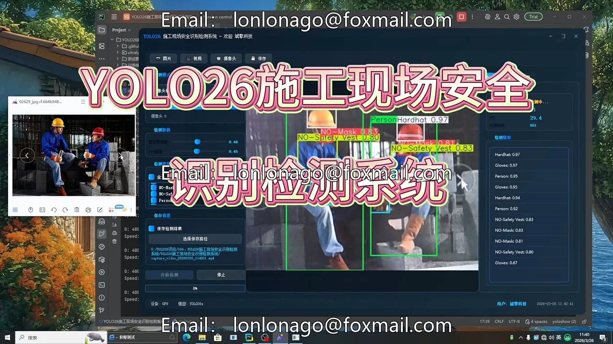
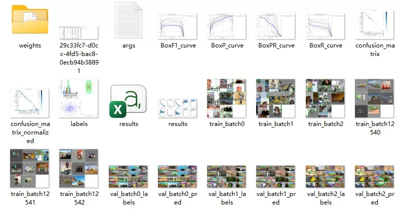
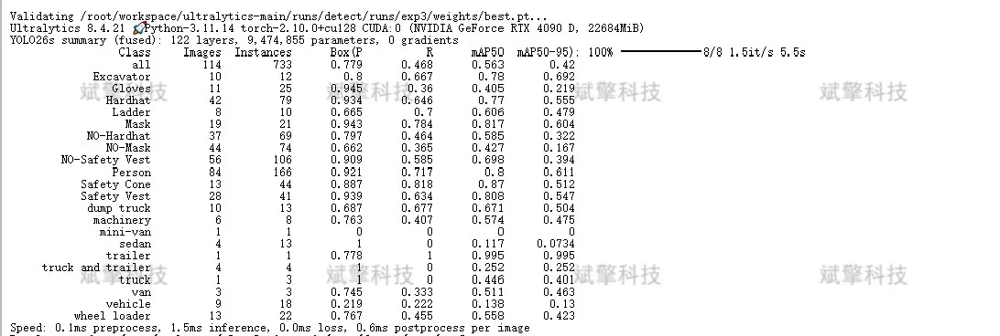
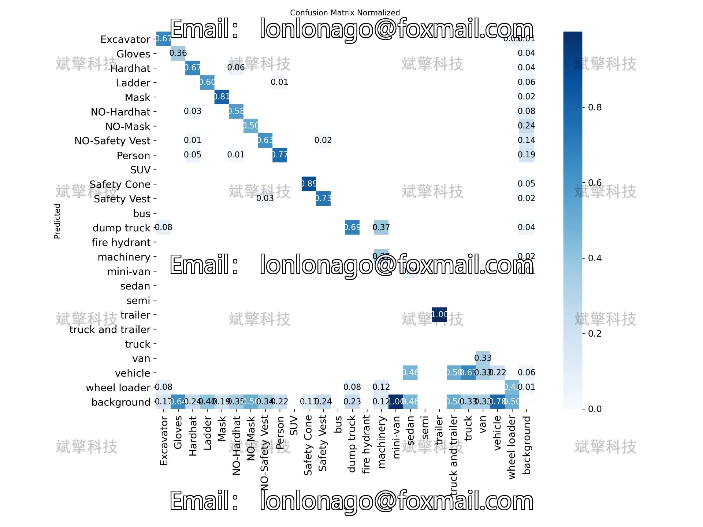
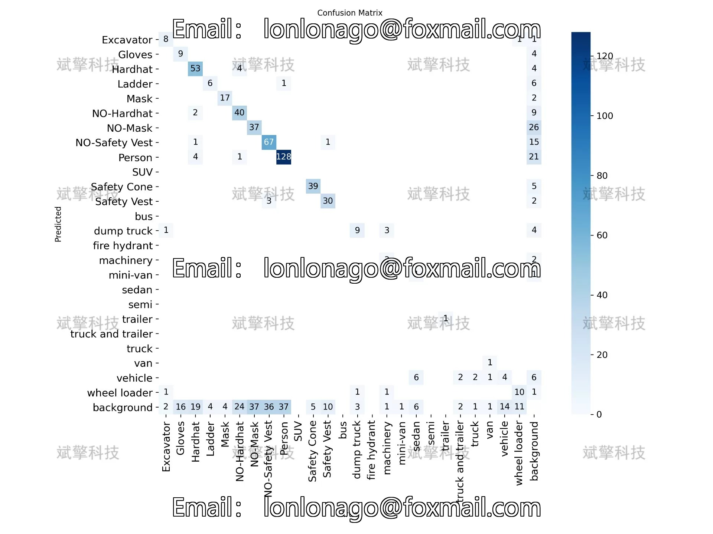
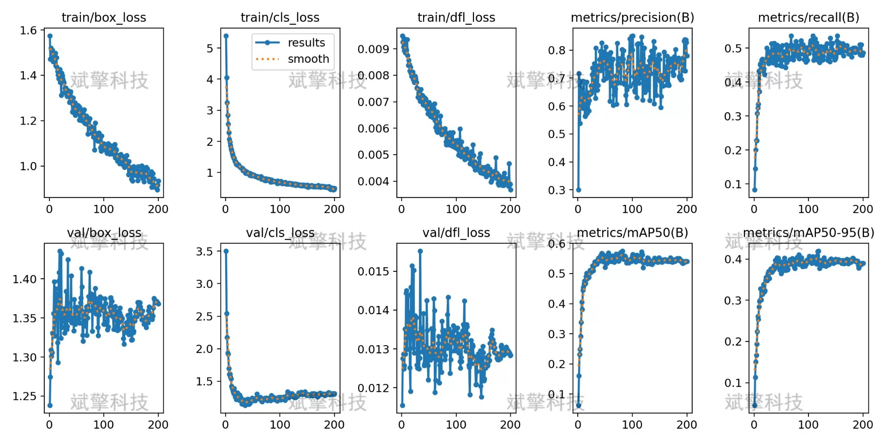
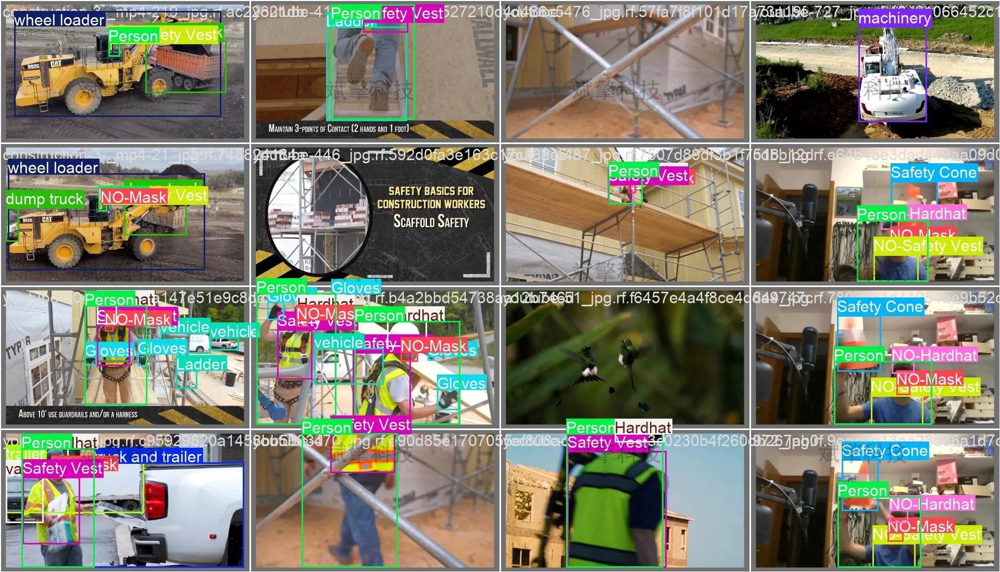
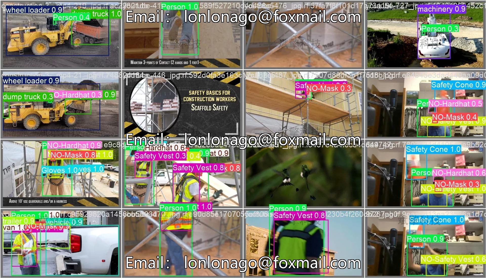

# YOLO26 Construction Site Safety Detection System | Dataset

## Body

YOLO26 Construction Site Safety Detection System | Dataset Based on YOLO26 for Construction Site Safety Identification and Detection (Project Source Code + Dataset + Model Weights + UI Interface + Python + Deep Learning + Remote Environment Deployment)

This research report is based on the YOLO26 object detection algorithm to build a construction site safety identification and detection system. This system targets 25 categories such as workers, safety equipment (helmets, masks, vests, gloves), engineering vehicles, and machinery in the construction scene for real-time detection and recognition. The experiment uses 521 images as the training set, 114 as the validation set, and 82 as the test set. Through systematic analysis of experimental results, this paper provides valuable references for intelligent safety management in construction sites.
Training Set: 521 images, used for learning model parameters
Validation Set: 114 images, used for model hyperparameter tuning and performance evaluation
Test Set: 82 images, used for final model performance testing

Free remote installation appointment. Unsuccessful full refund.
Purchase Enjoy the following resources (Baidu Pan file unlock automatically)
     YOLO Identification Detection Project Complete Source Code
    ️ YOLO format dataset
      Training code + UI interface code
      Trained model + result image
      Software installation package
    ️ Add WeChat appointment for remote installation (Automatic display of WeChat ID after purchase) - Unsuccessful, full refund

⚙️ Core function modules
Detection Capability
    Image detection: upload and check immediately, return detection box + category information
    Video detection: supports video files, analyzes each frame accurately
    Camera real-time detection: connect USB camera, realizes dynamic monitoring
Interaction and Control
    Target filtering: freely select one or more categories for detection
    Parameter real-time adjustment: adjustable confidence threshold & IoU threshold, flexible control accuracy
    Result saving: one-click save of image/video/camera detection results
System and Data
    User login registration: support password strength detection + encryption storage
    Log recording: automatically record operation and error information (with timestamp)

## Images

## Payment

Here is a pay link on Stripe ( https://buy.stripe.com/3cs8yP7sY87d0vu9AB ). Please contact me lonlonago@foxmail.com after funding $89, and I will send you a complete data files , thank you!

